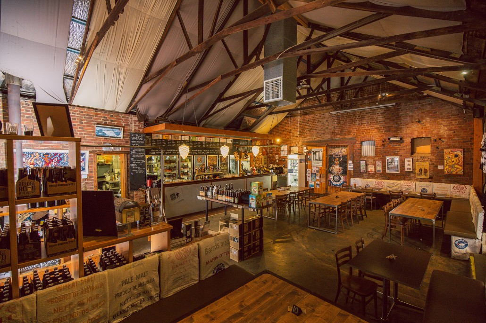
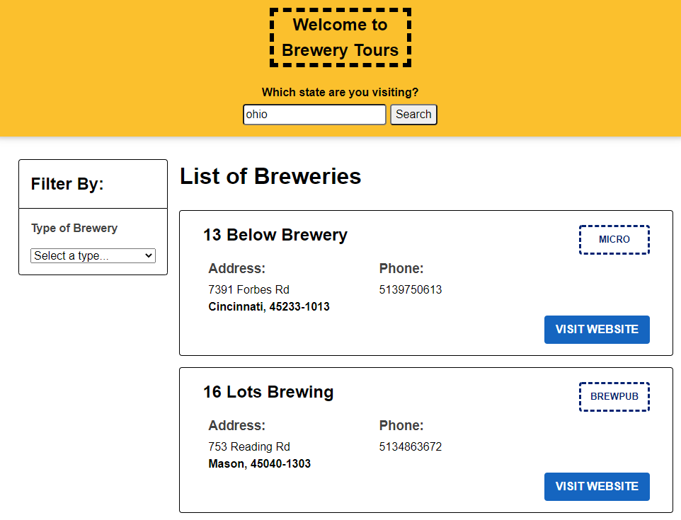
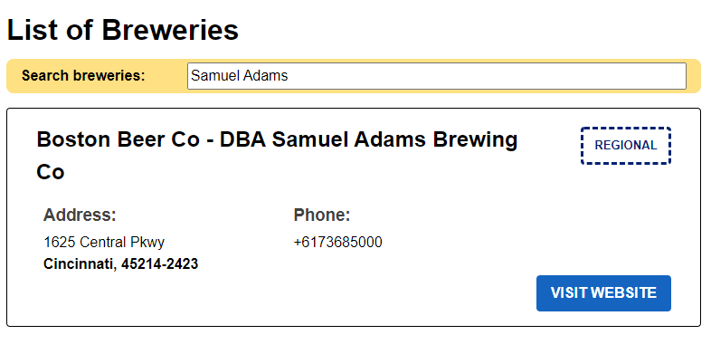

# Brewery Tours Challenge



## Setup

1. Fork this repository to your GitHub account
2. Clone your forked repository to your machine

## Description

In this challenge we explore a common scenario in eCommerce and booking sites, using filters and search to modify what we render from the state. You'll apply all the skills you've learned in the JS DOM unit: dynamic DOM creation, event listeners, state and requesting data from a server.

## Acceptance Criteria

Use the `index.html` file as a starting point. The `templates` folder provides HTML snippets that show how the dynamic elements of the page should be created.

### Standard



- A user can enter a US state and view a list of breweries in that state
  - The list should only shows the types of breweries that offer brewery tours:
    - Micro
    - Regional
    - Brewpub
  - **Do not** show the other types of breweries
- From the list of breweries, a user can view the following details about each brewery:
  - Name
  - Type of brewery
  - Address
  - Phone Number
- From the list of breweries, a user can visit the website of a brewery
- From the 'filter by type of brewery' section, a user can filter by type of brewery.

### Extension 1

- A new 'search' section should be added under the _List of Breweries_ heading
  
- From the 'search' section, a user can search for breweries by name
- As the user types, the brewery list should be updated automatically

### Extension 2

- Add a new 'filter by city' section to the filter menu
- The cities list should be populated based on the results of the search. Each city should only appear once.


- From the 'filter by city' section, the user can filter by city by selecting a checkbox beside the city name
- From the 'filter by city' section, a user can clear all filters

### Extension 3

- Add pagination to the list; if the list of breweries is greater than 10 a user can go to the next page to view more breweries.
- The user can also go back a page.

### Extension 4

Using json-server, add functionality to your page so the user can maintain a list of breweries they want to visit.

- For each brewery in the search results list, add a "Add to visit list" button.
- When the button is clicked, a POST request should be made to your json-server to store that brewery in a list of breweries the user wants to visit.
- For breweries that are already in that list, add a "Remove from visit list" button that when clicked should make a DELETE request to json-server to remove the brewery from the list.
- Add a link to the page that displays the list of breweries stored in the to visit list. You can decide where and how you want to display this - either alongside search results, or in a new section and allow the user to switch between the search functionality and the visit list.
- When the page is reloaded, the list of breweries to visit should be loaded from json-server.

For this extension, you will have to consider:

- How are you going to store the list of breweries to visit in json-server? What information will you need to capture?:
- When rendering the list of breweries from search results, how can you tell if the brewery is already in the list of breweries to visit?

For this extension, if you are using the Live Server plugin, you must also remember to exclude the db.json file of json-server from triggering a page reload. You can do this by creating a folder called `.vscode` at the root of your project. In there, you need to add a settings.json file with the below contents:

```json
{
	"liveServer.settings.ignoreFiles": ["**/*.json"]
}
```

Once this is done, you should also restart VS Code.

## Tips

- Read the "Open Brewery DB" documentation: https://www.openbrewerydb.org/documentation/01-listbreweries
- The API supports searching by different criteria. In this case, you want to search by state so the URL format you will use is: `https://api.openbrewerydb.org/breweries?by_state=[state]`, with `[state]` replaced with the state the user searches for.
- Start by sketching out your `state` object - what state exists in the application and how will you model it?
- Write your `fetch` request to load the data based on the users search. Use `console.log` with the response to make sure you understand the returned data structure.
- Remember to filter out breweries that are not of type `micro`, `regional` or `brewpub`.
- Implement the required functionality using the state pattern. User input updates the state, when the state is updated render the page.
